# 🚀 AWS Flask + Express Deployment on AWS

Deploy a **Python Flask backend** and a **Node.js Express frontend** using three different AWS deployment strategies, progressing from traditional EC2 deployments to a fully containerized architecture with Docker, Amazon ECR, and Amazon ECS (AWS Fargate).

---

# 📌 Project Overview

This project demonstrates three approaches for deploying a Flask backend and an Express frontend on Amazon Web Services (AWS).

The objective is to understand the evolution of cloud deployments—from hosting applications on EC2 instances to deploying containerized applications using Docker, Amazon Elastic Container Registry (ECR), and Amazon Elastic Container Service (ECS) with AWS Fargate.

This project was completed as part of an AWS DevOps deployment assignment.

---

# 🎯 Deployment Objectives

The project consists of the following deployment strategies.

## Part 1 – Single EC2 Deployment

Deploy both applications on a single Amazon EC2 instance.

- Ubuntu Server
- Flask Backend
- Express Frontend
- Nginx Reverse Proxy

---

## Part 2 – Two EC2 Deployment

Deploy the backend and frontend on separate EC2 instances.

- Backend EC2 Instance
- Frontend EC2 Instance
- Public IP Communication

---

## Part 3 – Containerized Deployment

Deploy Docker containers using AWS services.

- Docker
- Amazon Elastic Container Registry (ECR)
- Amazon ECS (AWS Fargate)
- Amazon VPC
- Application Load Balancer (ALB)

---

# 🏗️ Architecture

## Deployment 1 – Single EC2


---

## Deployment 2 – Separate EC2 Instances

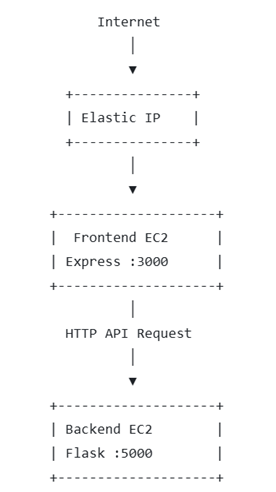

---

## Deployment 3 – Amazon ECS (Fargate)

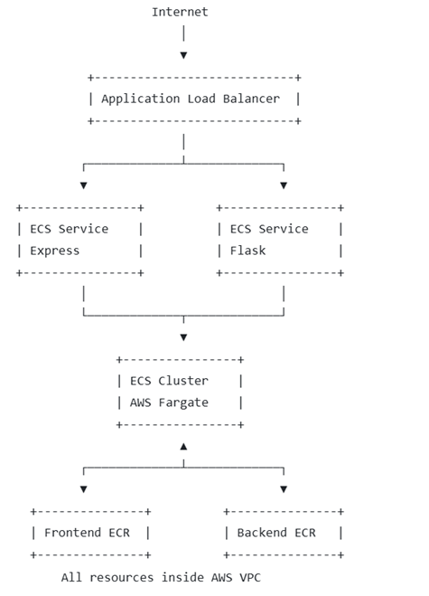

---

# 📂 Project Structure

```text
DevOps_6-AWS/
│
├── architecture/
│   ├── deployment1.png
│   ├── deployment2.png
│   └── deployment3.png
│
├── backend/
│   ├── app.py
│   ├── requirements.txt
│   ├── Dockerfile
│   ├── .dockerignore
│   └── .env
│
├── frontend/
│   ├── package.json
│   ├── server.js
│   ├── public/
│   │   ├── index.html
│   │   ├── app.js
│   │   └── style.css
│   ├── Dockerfile
│   ├── .dockerignore
│   └── .env
│
├── nginx/
│   └── nginx.conf
│
├── screenshots/
│   ├── 01-ec2-created.png
│   ├── 02-security-group.png
│   ├── 03-backend-running.png
│   ├── 04-frontend-running.png
│   ├── 05-browser.png
│   ├── 06-two-ec2.png
│   ├── 07-ecr.png
│   ├── 08-ecs-cluster.png
│   ├── 09-task-definition.png
│   ├── 10-service.png
│   ├── 11-load-balancer.png
│   └── 12-final-output.png
│
├── docker-compose.yml
└── README.md
```

---

# 🛠️ Technologies Used

| Category | Technology |
|----------|------------|
| Cloud Platform | AWS |
| Compute | Amazon EC2 |
| Containers | Docker |
| Container Registry | Amazon ECR |
| Container Orchestration | Amazon ECS (Fargate) |
| Networking | Amazon VPC |
| Load Balancer | Application Load Balancer |
| Backend | Python Flask |
| Frontend | Node.js Express |
| Reverse Proxy | Nginx |
| Version Control | Git |
| Repository Hosting | GitHub |

---

# 📋 Prerequisites

Before starting, ensure the following software and accounts are available.

## AWS

- AWS Account
- IAM User
- AWS CLI Configured

## Local Machine

- Git
- Docker Desktop
- Python 3.12+
- Node.js 20+
- Visual Studio Code

---

# ✅ Verify Installation

### Git

```bash
git --version
```

### Docker

```bash
docker --version
```

### Python

```bash
python --version
```

### Node.js

```bash
node -v
```

### AWS CLI

```bash
aws --version
```

---

# 📥 Clone the Repository

```bash
git clone https://https://github.com/mohammadshakirsaifi/DevOps_6-AWS.git

cd DevOps_6-AWS
```

---

# 📸 Deployment Walkthrough

## Part 1 – Single EC2 Deployment

### 1. EC2 Instance Created

Created an Ubuntu EC2 instance to host both the Flask backend and Express frontend.

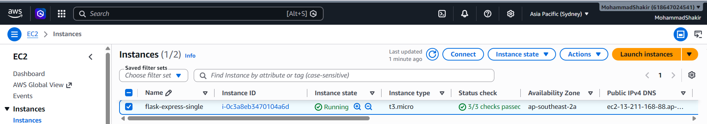

---

### 2. Security Group Configuration

Configured inbound rules to allow:

- SSH (22)
- HTTP (80)
- Express (3000)
- Flask API (5000)

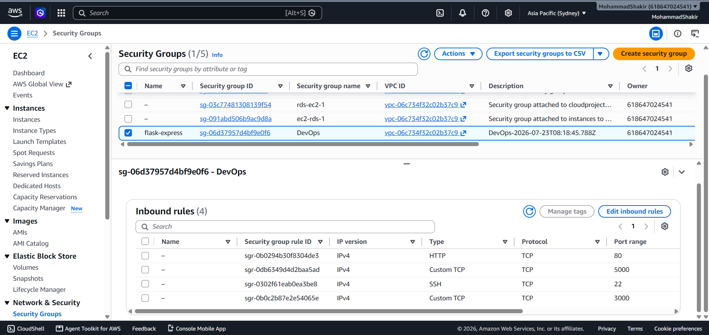

---

### 3. Flask Backend Running

Started the Flask backend on port **5000**.

```bash
cd backend

python3 -m venv venv
source venv/bin/activate
pip install -r requirements.txt
python app.py
```

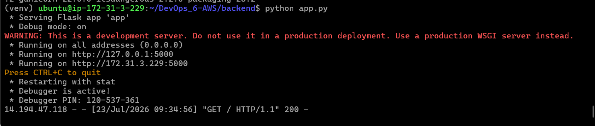

---

### 4. Express Frontend Running

Started the Express frontend on port **3000**.

```bash
cd frontend

npm install
npm start
```

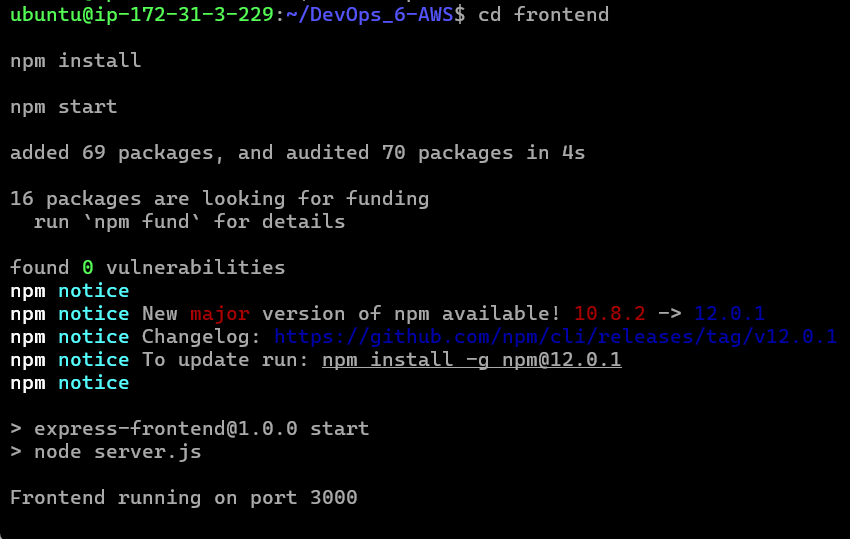

---

### 5. Application Running

Successfully accessed the application using the EC2 Public IP.

```
http://<EC2-Public-IP>:3000
```

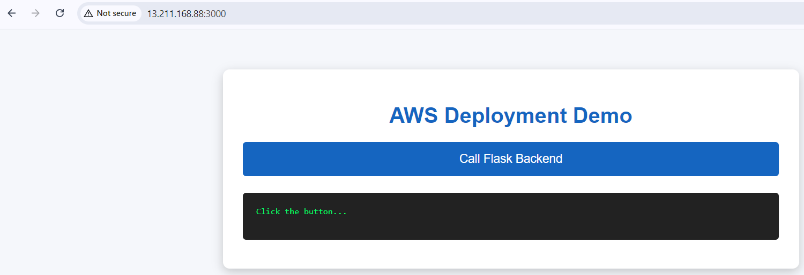

---

# Part 2 – Separate EC2 Deployment

### 6. Two EC2 Instances

Created separate EC2 instances for the backend and frontend.

- Backend Server
- Frontend Server

The frontend communicates with the backend using the backend server's public IP address.

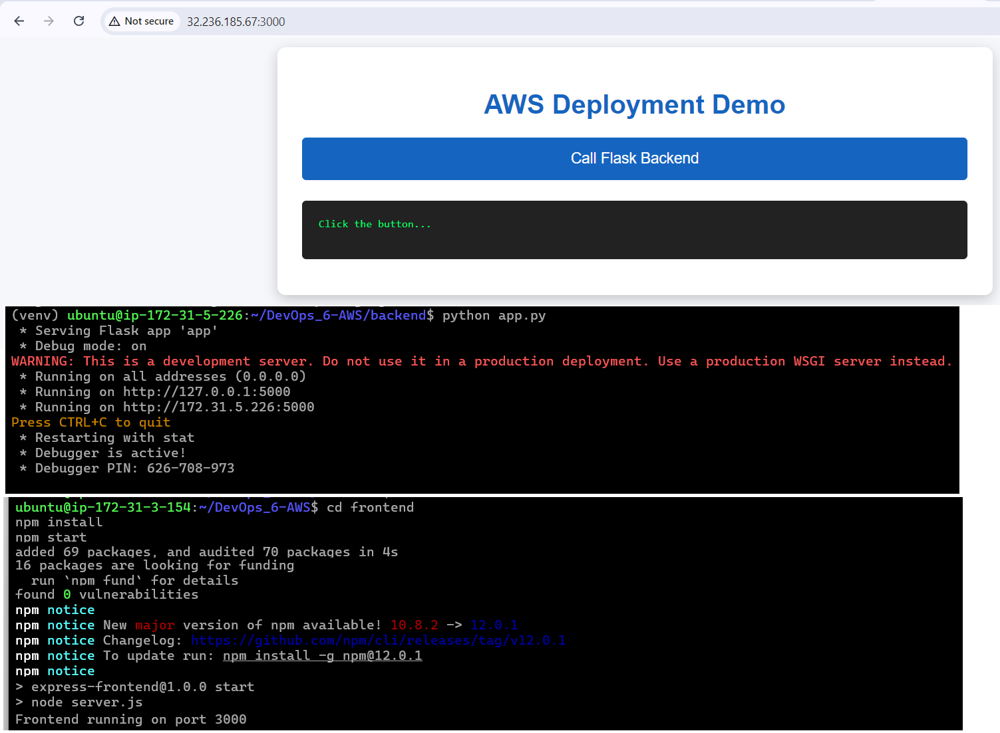

---

# Part 3 – Docker Deployment with Amazon ECS

### 7. Amazon Elastic Container Registry (ECR)

Created two ECR repositories.

- backend-repository
- frontend-repository

Successfully built and pushed Docker images.

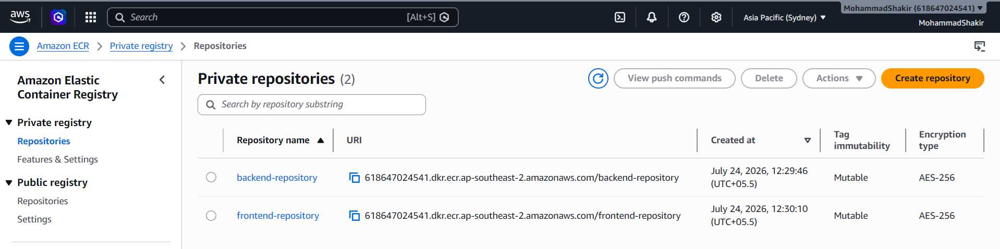

---

### 8. Amazon ECS Cluster

Created an ECS Cluster using AWS Fargate.

**Cluster Name**

```
aws-flask-cluster
```

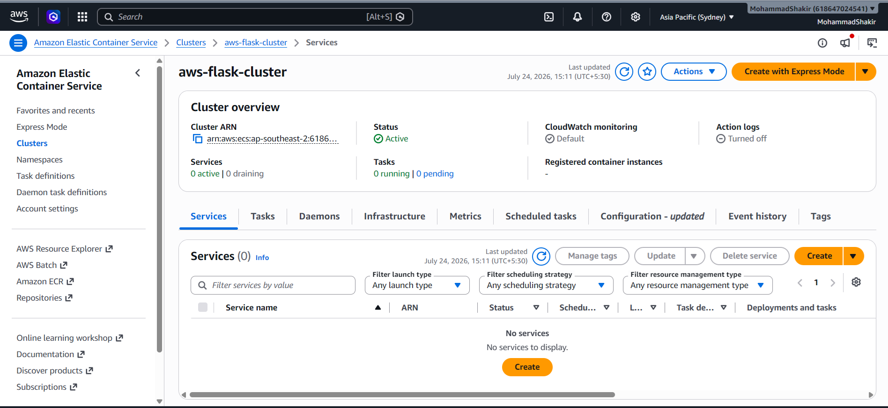

---

### 9. ECS Task Definitions

Created task definitions for:

- backend-task
- frontend-task

Configured:

- CPU
- Memory
- Container Images
- Port Mappings

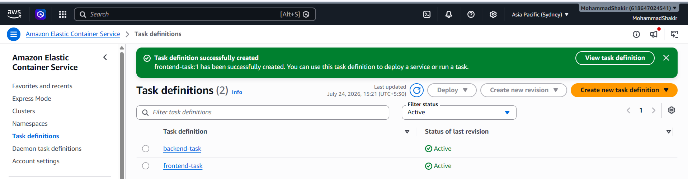

---

### 10. ECS Services

Created ECS services for both applications.

- backend-service
- frontend-service

Verified that both tasks were running successfully.

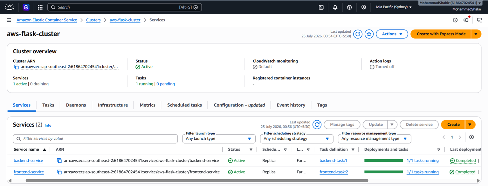

---

### 11. Application Load Balancer

Configured an internet-facing Application Load Balancer.

Features:

- HTTP Listener
- Target Groups
- Health Checks

Successfully routed traffic to ECS services.

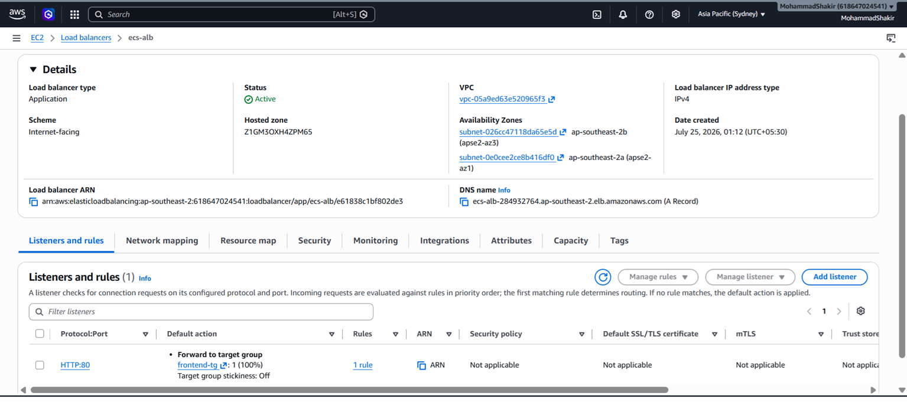

---

### 12. Final Application Output

Successfully deployed the application using:

- Docker
- Amazon ECR
- Amazon ECS (Fargate)
- Amazon VPC
- Application Load Balancer

The application is accessible through the Load Balancer DNS endpoint.

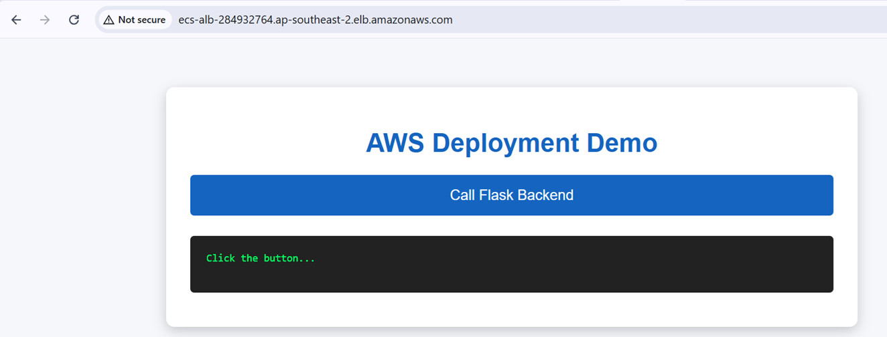

---

# ✅ Deployment Summary

| Deployment Task | Status |
|-----------------|--------|
| Single EC2 Deployment | ✅ Completed |
| Separate EC2 Deployment | ✅ Completed |
| Docker Image Creation | ✅ Completed |
| Amazon ECR Deployment | ✅ Completed |
| Amazon ECS (Fargate) Deployment | ✅ Completed |
| Amazon VPC Configuration | ✅ Completed |
| Application Load Balancer Configuration | ✅ Completed |
| End-to-End Application Testing | ✅ Successful |

---

# 📚 Key AWS Services Used

- Amazon EC2
- Amazon VPC
- Amazon ECR
- Amazon ECS (AWS Fargate)
- Application Load Balancer
- IAM
- Security Groups
- Docker
- Nginx

---

# 👨‍💻 Author

**Mohammad Shakir**

AWS DevOps Deployment Project
